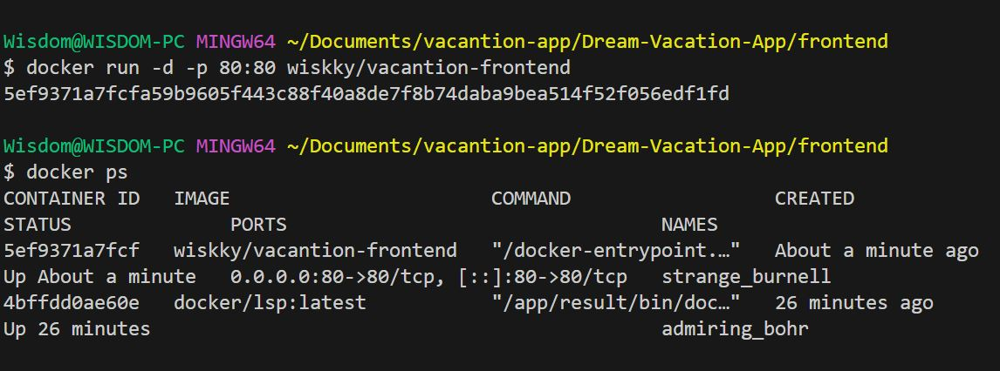
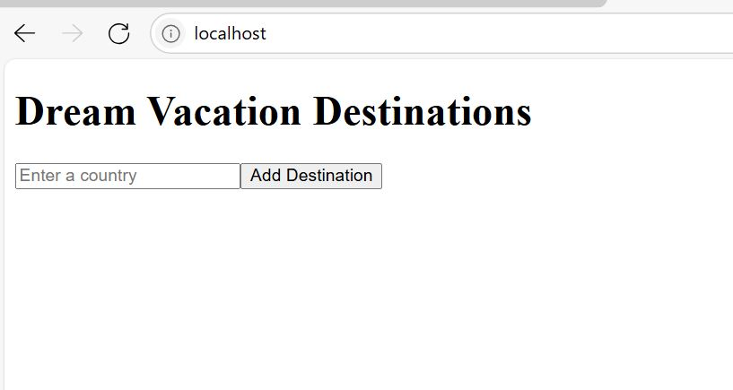
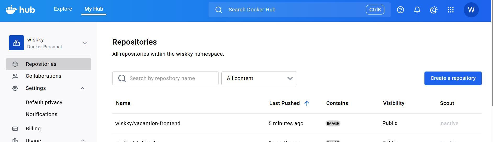

# Dream-Vacation-App
Dream-Vacation-App
**Ensure required packages are installed**
Install react, react-dom, react-scripts, axios
Use `RUN npm install react react-dom react-scripts axios`

**You can build frontend and backend separately by using docker build command. Also you can also use docker-compose command to buuild and run both rontend and backend with the databbase together.**    
**Note:** We use postgress database 

**To build frontend, kindly use**  
`# docker build . -t vacantion-frontend:latest `  

You must run this command where the Dockerfile is located

**To push this to docker hub, we need to tag our image**  
`# docker build . -t wiskky/vacantion-frontend:latest` 

You can check your image by running     
`# docker images`  

To containarize your docker image, run 
`# docker run -d -p 80:80 wiskky/vacancy-frontend`

Note wiskky is my docker hub username, change it to your own docker hub username. 

Then run `# docker ps`

  

On your broswer, type http:localhost

To push your image into docker hub, Then run 

`# docker push wiskky/vacantion-frontend:latest` 

Login into your docker hhub accont and check 

**NOTE** For backend ollow the same step aove to run docker build command and push.

# Using docker compose to dockerize your application
